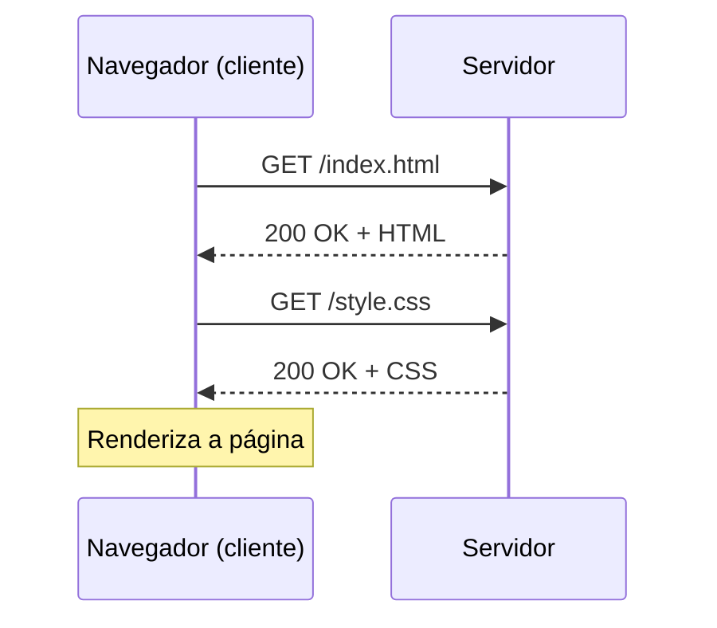

# Aula 01 — Fundamentos da Web e HTML Semântico

!!! info "Objetivos da aula"
    - Entender **como a web funciona** (cliente, servidor, HTTP).
    - Conhecer a anatomia de um documento **HTML5**.
    - Escrever marcação **semântica** e acessível.

## Como a web funciona

Quando você digita um endereço no navegador, ele (o **cliente**) faz uma requisição **HTTP** a um **servidor**, que responde com arquivos — geralmente HTML, CSS e JavaScript.



O trio da web:

| Tecnologia | Papel | Analogia |
| :--------- | :---- | :------- |
| **HTML** | Estrutura e conteúdo | O esqueleto |
| **CSS** | Apresentação e estilo | A roupa |
| **JavaScript** | Comportamento e interação | Os músculos |

## Anatomia de um documento HTML5

```html
<!DOCTYPE html>
<html lang="pt-BR">
  <head>
    <meta charset="UTF-8" />
    <meta name="viewport" content="width=device-width, initial-scale=1.0" />
    <title>Minha primeira página</title>
  </head>
  <body>
    <h1>Olá, mundo!</h1>
    <p>Estou aprendendo desenvolvimento web.</p>
  </body>
</html>
```

!!! warning "Nunca esqueça"
    A tag `<meta name="viewport">` é **essencial** para páginas responsivas. Sem ela, o celular renderiza a página como se fosse um desktop encolhido.

## Semântica: use a tag certa

Marcação semântica descreve o **significado** do conteúdo, não sua aparência. Isso ajuda o Google, leitores de tela e outros desenvolvedores.

=== "❌ Sem semântica"
    ```html
    <div class="topo">
      <div class="menu">...</div>
    </div>
    <div class="conteudo">
      <div class="artigo">...</div>
    </div>
    <div class="rodape">...</div>
    ```

=== "✅ Com semântica"
    ```html
    <header>
      <nav>...</nav>
    </header>
    <main>
      <article>...</article>
    </main>
    <footer>...</footer>
    ```

Principais tags estruturais: `<header>`, `<nav>`, `<main>`, `<section>`, `<article>`, `<aside>`, `<footer>`, `<figure>`.

!!! tip "Regra de ouro"
    Só use `<div>` quando **nenhuma** tag semântica descrever melhor o conteúdo. `<div>` é uma caixa neutra, sem significado.

## Exercícios

??? abstract "Exercício 1 — Página de perfil"
    Crie uma página `perfil.html` com estrutura semântica: um `<header>` com seu nome, um `<main>` com um `<article>` de apresentação e um `<footer>` com seus links. Valide se todo o texto está dentro de tags apropriadas (nada de texto solto no `<body>`).

??? abstract "Exercício 2 — Corrigindo a marcação"
    Dado o HTML abaixo, reescreva-o usando tags semânticas:
    ```html
    <div id="cabecalho"><div id="titulo">Meu Blog</div></div>
    <div id="post"><div id="txt">Primeiro post...</div></div>
    <div id="rodape">© 2026</div>
    ```

??? abstract "Exercício 3 — Listas e tabelas"
    Monte uma página com: uma lista **ordenada** dos seus 3 objetivos na disciplina, uma lista **não ordenada** de 3 ferramentas que você conhece, e uma **tabela** com 3 linguagens e seu ano de criação.

!!! tip "Próxima Parada"
    Sua página está estruturada, mas "crua". Na próxima aula damos vida a ela com CSS! Antes disso, resolva a 👉 [**Lista 01**](../listas/01-lista.md).
