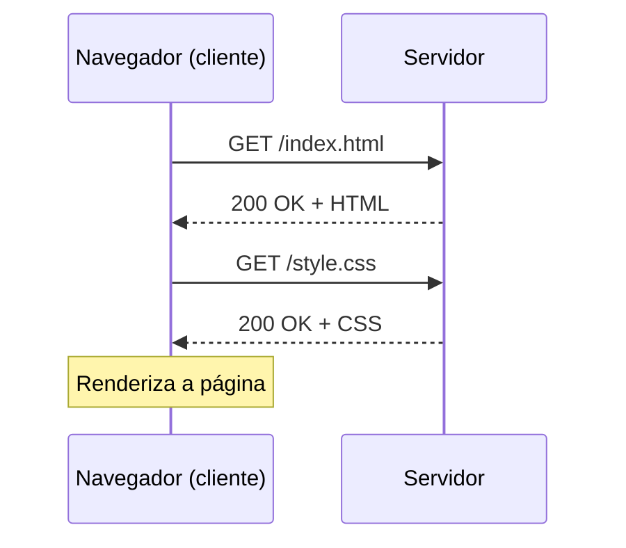

# Aula 01 — Fundamentos da Web e HTML Semântico

!!! info "Objetivos da aula"
    - Entender **como a web funciona** (cliente, servidor, HTTP).
    - Conhecer a anatomia de um documento **HTML5**.
    - Escrever marcação **semântica** e acessível.

## Como a web funciona

Quando você digita um endereço no navegador, ele (o **cliente**) faz uma requisição **HTTP** a um **servidor**, que responde com arquivos — geralmente HTML, CSS e JavaScript.



O trio da web:

| Tecnologia | Papel | Analogia |
| :--------- | :---- | :------- |
| **HTML** | Estrutura e conteúdo | O esqueleto |
| **CSS** | Apresentação e estilo | A roupa |
| **JavaScript** | Comportamento e interação | Os músculos |

## Anatomia de um documento HTML5

```html
<!DOCTYPE html>
<html lang="pt-BR">
  <head>
    <meta charset="UTF-8" />
    <meta name="viewport" content="width=device-width, initial-scale=1.0" />
    <title>Minha primeira página</title>
  </head>
  <body>
    <h1>Olá, mundo!</h1>
    <p>Estou aprendendo desenvolvimento web.</p>
  </body>
</html>
```

!!! warning "Nunca esqueça"
    A tag `<meta name="viewport">` é **essencial** para páginas responsivas. Sem ela, o celular renderiza a página como se fosse um desktop encolhido.

## Semântica: use a tag certa

Marcação semântica descreve o **significado** do conteúdo, não sua aparência. Isso ajuda o Google, leitores de tela e outros desenvolvedores.

=== "❌ Sem semântica"
    ```html
    <div class="topo">
      <div class="menu">...</div>
    </div>
    <div class="conteudo">
      <div class="artigo">...</div>
    </div>
    <div class="rodape">...</div>
    ```

=== "✅ Com semântica"
    ```html
    <header>
      <nav>...</nav>
    </header>
    <main>
      <article>...</article>
    </main>
    <footer>...</footer>
    ```

Principais tags estruturais: `<header>`, `<nav>`, `<main>`, `<section>`, `<article>`, `<aside>`, `<footer>`, `<figure>`.

!!! tip "Regra de ouro"
    Só use `<div>` quando **nenhuma** tag semântica descrever melhor o conteúdo. `<div>` é uma caixa neutra, sem significado.

## Elementos de bloco x elementos em linha

Todo elemento HTML tem um comportamento de exibição padrão:

=== "Bloco (block)"
    Ocupam **toda a largura** disponível e começam em uma nova linha. Ex.: `<div>`, `<p>`, `<h1>`–`<h6>`, `<section>`, `<ul>`, `<li>`.

=== "Em linha (inline)"
    Ocupam **apenas o espaço do conteúdo** e ficam lado a lado. Ex.: `<a>`, `<span>`, `<strong>`, `<em>`, ``.

!!! warning "Regras de aninhamento"
    Elementos em linha **não devem** conter elementos de bloco. Ex.: um `<a>` pode envolver um `<span>`, mas evite colocar um `<div>` dentro de um `<span>`. Já um `<li>` só faz sentido dentro de `<ul>` ou `<ol>`.

## As tags que você mais vai usar

### Títulos e parágrafos

Use `<h1>` a `<h6>` para criar uma **hierarquia**. Deve existir **um único `<h1>`** por página (o título principal), e os níveis não devem "pular" (não vá de `<h1>` direto para `<h3>`).

```html
<h1>Meu Portfólio</h1>
  <h2>Sobre mim</h2>
  <h2>Projetos</h2>
    <h3>Projeto A</h3>
```

### Links e imagens

```html
<a href="https://exemplo.com" target="_blank" rel="noopener">Abrir site</a>
<a href="perfil.html">Página interna</a>
<a href="#contato">Ir para uma âncora na mesma página</a>


```

| Atributo | Onde | Para que serve |
| :------- | :--- | :------------- |
| `href` | `<a>` | Destino do link |
| `src` | `` | Caminho do arquivo |
| `alt` | `` | Texto alternativo (acessibilidade e SEO) |
| `target="_blank"` | `<a>` | Abre em nova aba |

!!! danger "Sempre use alt em imagens"
    Sem `alt`, leitores de tela anunciam apenas "imagem" e o SEO fica prejudicado. Se a imagem for puramente decorativa, use `alt=""` (vazio) para que seja ignorada.

### Listas

```html
<!-- Ordenada: a ordem importa (passos, ranking) -->
<ol>
  <li>Instalar o VS Code</li>
  <li>Instalar o Git</li>
</ol>

<!-- Não ordenada: a ordem não importa -->
<ul>
  <li>HTML</li>
  <li>CSS</li>
</ul>
```

### Tabelas

Tabelas servem para **dados tabulares**, nunca para layout. A estrutura mínima é:

```html
<table>
  <thead>
    <tr><th>Linguagem</th><th>Ano</th></tr>
  </thead>
  <tbody>
    <tr><td>JavaScript</td><td>1995</td></tr>
    <tr><td>Python</td><td>1991</td></tr>
  </tbody>
</table>
```

| Tag | Papel |
| :-- | :---- |
| `<table>` | A tabela |
| `<thead>` / `<tbody>` | Cabeçalho / corpo |
| `<tr>` | Linha (*table row*) |
| `<th>` | Célula de cabeçalho |
| `<td>` | Célula de dado |

## Comentários e caracteres especiais

```html
<!-- Isto é um comentário: não aparece na página -->

<p>Use &lt; e &gt; para escrever &lt;tags&gt; como texto.</p>
<p>&amp; vira &, e &copy; vira ©.</p>
```

!!! info "Entidades HTML"
    Alguns caracteres têm significado na linguagem (`<`, `>`, `&`). Para exibi-los literalmente, use **entidades**: `&lt;`, `&gt;`, `&amp;`.

## Exercícios

??? abstract "Exercício 1 — Página de perfil"
    Crie uma página `perfil.html` com estrutura semântica: um `<header>` com seu nome, um `<main>` com um `<article>` de apresentação e um `<footer>` com seus links. Valide se todo o texto está dentro de tags apropriadas (nada de texto solto no `<body>`).

??? abstract "Exercício 2 — Corrigindo a marcação"
    Dado o HTML abaixo, reescreva-o usando tags semânticas:
    ```html
    <div id="cabecalho"><div id="titulo">Meu Blog</div></div>
    <div id="post"><div id="txt">Primeiro post...</div></div>
    <div id="rodape">© 2026</div>
    ```

??? abstract "Exercício 3 — Listas e tabelas"
    Monte uma página com: uma lista **ordenada** dos seus 3 objetivos na disciplina, uma lista **não ordenada** de 3 ferramentas que você conhece, e uma **tabela** com 3 linguagens e seu ano de criação.

!!! tip "Próxima Parada"
    Sua página está estruturada, mas "crua". Na próxima aula damos vida a ela com CSS! Antes disso, resolva a 👉 [**Lista 01**](../listas/01-lista.md).

## 📚 Referências

- [MDN — Introdução ao HTML](https://developer.mozilla.org/pt-BR/docs/Learn/HTML/Introduction_to_HTML)
- [MDN — Referência de elementos HTML](https://developer.mozilla.org/pt-BR/docs/Web/HTML/Element)
- [MDN — HTML semântico](https://developer.mozilla.org/pt-BR/docs/Glossary/Semantics#semântica_em_html)
- [web.dev — Learn HTML](https://web.dev/learn/html/)
- [W3C — HTML Standard (referência oficial)](https://html.spec.whatwg.org/multipage/)
