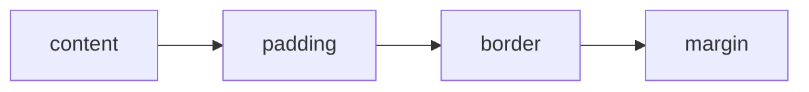

# Aula 02 — CSS: Estilização e Box Model

!!! info "Objetivos da aula"
    - Conectar CSS ao HTML e escrever **seletores**.
    - Dominar o **Box Model** (margin, border, padding, content).
    - Entender **especificidade** e a cascata.

## Três formas de aplicar CSS

=== "Externo (recomendado)"
    ```html
    <link rel="stylesheet" href="style.css" />
    ```

=== "Interno"
    ```html
    <style>
      body { background: #f5f5f5; }
    </style>
    ```

=== "Inline (evite)"
    ```html
    <p style="color: red;">Texto</p>
    ```

!!! tip "Boa prática"
    Prefira **sempre** o CSS externo: separa estrutura (HTML) de apresentação (CSS) e permite reaproveitar estilos entre páginas.

## Seletores

```css
/* por tag */
p { color: #333; }

/* por classe (reutilizável) */
.destaque { background: yellow; }

/* por id (único) */
#topo { position: sticky; }

/* descendente */
nav a { text-decoration: none; }
```

| Seletor | Exemplo | Alcança |
| :------ | :------ | :------ |
| Tag | `h1` | Todos os `<h1>` |
| Classe | `.btn` | Elementos com `class="btn"` |
| Id | `#menu` | O elemento com `id="menu"` |
| Universal | `*` | Tudo |

## O Box Model

Todo elemento é uma **caixa** composta por 4 camadas, de dentro para fora:



```css
.card {
  width: 300px;
  padding: 16px;   /* espaço interno */
  border: 2px solid #ccc;
  margin: 24px;    /* espaço externo */
}
```

!!! danger "A pegadinha do tamanho"
    Por padrão, `width` mede **só o content**. Adicione `box-sizing: border-box` para que padding e border sejam incluídos na largura — evita cálculos frustrantes.

    ```css
    * { box-sizing: border-box; }
    ```

## Cores, fontes e unidades

```css
body {
  font-family: "Inter", sans-serif;
  font-size: 16px;
  line-height: 1.5;
  color: #222;
}
```

| Unidade | Tipo | Uso comum |
| :------ | :--- | :-------- |
| `px` | Absoluta | Bordas, detalhes finos |
| `rem` | Relativa à raiz | Tamanhos de fonte |
| `%` | Relativa ao pai | Larguras fluidas |
| `vw`/`vh` | Viewport | Seções em tela cheia |

## Exercícios

??? abstract "Exercício 1 — Cartão de visita"
    Estilize um `<article>` como um cartão: largura fixa, `padding`, `border`, cantos arredondados (`border-radius`) e uma sombra (`box-shadow`). Use `box-sizing: border-box`.

??? abstract "Exercício 2 — Explorando o Box Model"
    Crie 3 caixas com o mesmo `width` mas `padding` e `border` diferentes. Abra o **DevTools** (aba *Computed*) e observe o diagrama do box model de cada uma.

??? abstract "Exercício 3 — Paleta e tipografia"
    Defina para uma página: uma cor de fundo, uma cor de texto com bom contraste, uma fonte importada do Google Fonts e `line-height: 1.6`. Justifique suas escolhas em um comentário no CSS.

!!! tip "Próxima Parada"
    Você sabe estilizar caixas — agora vamos **organizá-las na tela** com Flexbox e Grid. Antes, mãos à obra na 👉 [**Lista 02**](../listas/02-lista.md).
