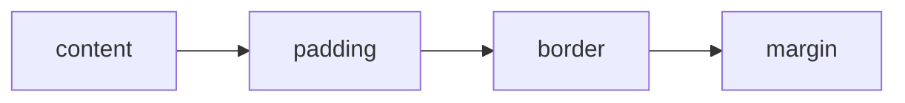
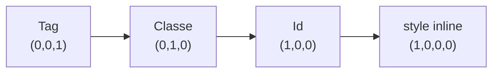

# Aula 02 — CSS: Estilização e Box Model

!!! info "Objetivos da aula"
    - Conectar CSS ao HTML e escrever **seletores**.
    - Dominar o **Box Model** (margin, border, padding, content).
    - Entender **especificidade** e a cascata.

## Três formas de aplicar CSS

=== "Externo (recomendado)"
    ```html
    <link rel="stylesheet" href="style.css" />
    ```

=== "Interno"
    ```html
    <style>
      body { background: #f5f5f5; }
    </style>
    ```

=== "Inline (evite)"
    ```html
    <p style="color: red;">Texto</p>
    ```

!!! tip "Boa prática"
    Prefira **sempre** o CSS externo: separa estrutura (HTML) de apresentação (CSS) e permite reaproveitar estilos entre páginas.

## Seletores

```css
/* por tag */
p { color: #333; }

/* por classe (reutilizável) */
.destaque { background: yellow; }

/* por id (único) */
#topo { position: sticky; }

/* descendente */
nav a { text-decoration: none; }
```

| Seletor | Exemplo | Alcança |
| :------ | :------ | :------ |
| Tag | `h1` | Todos os `<h1>` |
| Classe | `.btn` | Elementos com `class="btn"` |
| Id | `#menu` | O elemento com `id="menu"` |
| Universal | `*` | Tudo |

## O Box Model

Todo elemento é uma **caixa** composta por 4 camadas, de dentro para fora:



```css
.card {
  width: 300px;
  padding: 16px;   /* espaço interno */
  border: 2px solid #ccc;
  margin: 24px;    /* espaço externo */
}
```

!!! danger "A pegadinha do tamanho"
    Por padrão, `width` mede **só o content**. Adicione `box-sizing: border-box` para que padding e border sejam incluídos na largura — evita cálculos frustrantes.

    ```css
    * { box-sizing: border-box; }
    ```

## Cores, fontes e unidades

```css
body {
  font-family: "Inter", sans-serif;
  font-size: 16px;
  line-height: 1.5;
  color: #222;
}
```

| Unidade | Tipo | Uso comum |
| :------ | :--- | :-------- |
| `px` | Absoluta | Bordas, detalhes finos |
| `rem` | Relativa à raiz | Tamanhos de fonte |
| `%` | Relativa ao pai | Larguras fluidas |
| `vw`/`vh` | Viewport | Seções em tela cheia |

## Especificidade e a cascata

Quando duas regras diferentes atingem o mesmo elemento, o CSS decide qual vence pela **especificidade**. Quanto mais específico o seletor, maior seu "peso":



| Seletor | Especificidade | Vence de... |
| :------ | :------------- | :---------- |
| `p` | baixa | nada |
| `.destaque` | média | tags |
| `#topo` | alta | classes e tags |
| `style="..."` | máxima | quase tudo |

!!! warning "Fuja do `!important`"
    Em caso de empate, vence a **última** regra declarada. O `!important` sobrescreve tudo, mas vira uma bola de neve — evite-o e prefira ajustar a especificidade ou a ordem das regras.

### Pseudo-classes e pseudo-elementos

```css
a:hover { color: #7c4dff; }      /* ao passar o mouse */
input:focus { outline: 2px solid; } /* ao focar */
li:first-child { font-weight: bold; }
p::first-line { text-transform: uppercase; }
```

## Cores: as formas de escrever

```css
.exemplo {
  color: #7c4dff;                 /* hexadecimal */
  color: rgb(124, 77, 255);       /* RGB */
  color: rgba(124, 77, 255, 0.5); /* com transparência (alpha) */
  color: hsl(255, 100%, 65%);     /* matiz, saturação, luminosidade */
}
```

!!! tip "HSL é ótimo para paletas"
    Com **HSL** você cria variações de uma cor mudando só a luminosidade — perfeito para estados *hover* e temas. Ex.: `hsl(255, 100%, 65%)` e `hsl(255, 100%, 45%)` (mais escura).

## Detalhes que deixam o cartão bonito

Estas propriedades são a base do **Exercício 1** (cartão de visita):

```css
.card {
  border-radius: 12px;                       /* cantos arredondados */
  box-shadow: 0 4px 12px rgba(0, 0, 0, 0.15); /* sombra */
  background: #fff;
}
```

Anatomia da `box-shadow`: `deslocamento-x  deslocamento-y  desfoque  cor`.

## Tipografia na prática

Para o **Exercício 3**, importe uma fonte do Google Fonts no `<head>` e aplique no CSS:

```html
<link href="https://fonts.googleapis.com/css2?family=Inter&display=swap" rel="stylesheet" />
```

```css
body {
  font-family: "Inter", sans-serif;
  font-size: 1rem;      /* 16px por padrão */
  line-height: 1.6;     /* espaçamento entre linhas confortável */
  letter-spacing: 0.2px;
}
```

## Exercícios

??? abstract "Exercício 1 — Cartão de visita"
    Estilize um `<article>` como um cartão: largura fixa, `padding`, `border`, cantos arredondados (`border-radius`) e uma sombra (`box-shadow`). Use `box-sizing: border-box`.

??? abstract "Exercício 2 — Explorando o Box Model"
    Crie 3 caixas com o mesmo `width` mas `padding` e `border` diferentes. Abra o **DevTools** (aba *Computed*) e observe o diagrama do box model de cada uma.

??? abstract "Exercício 3 — Paleta e tipografia"
    Defina para uma página: uma cor de fundo, uma cor de texto com bom contraste, uma fonte importada do Google Fonts e `line-height: 1.6`. Justifique suas escolhas em um comentário no CSS.

!!! tip "Próxima Parada"
    Você sabe estilizar caixas — agora vamos **organizá-las na tela** com Flexbox e Grid. Antes, mãos à obra na 👉 [**Lista 02**](../listas/02-lista.md).

## 📚 Referências

- [MDN — Primeiros passos com CSS](https://developer.mozilla.org/pt-BR/docs/Learn/CSS/First_steps)
- [MDN — O modelo de caixa (Box Model)](https://developer.mozilla.org/pt-BR/docs/Learn/CSS/Building_blocks/The_box_model)
- [MDN — Especificidade](https://developer.mozilla.org/pt-BR/docs/Web/CSS/Specificity)
- [web.dev — Learn CSS](https://web.dev/learn/css/)
- [Google Fonts](https://fonts.google.com/)
