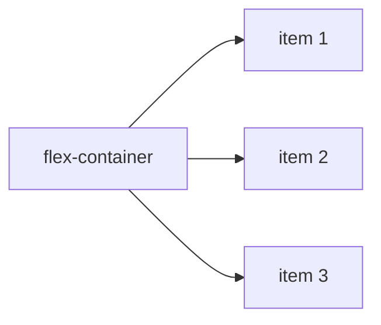

# Aula 03 — Layouts Modernos: Flexbox e Grid

!!! info "Objetivos da aula"
    - Alinhar e distribuir elementos com **Flexbox** (1 dimensão).
    - Montar layouts bidimensionais com **CSS Grid**.
    - Saber **quando** usar cada um.

## Flexbox vs Grid: o resumo

=== "Flexbox — 1 dimensão"
    Organiza itens em **uma linha OU uma coluna**. Ideal para: barras de navegação, botões alinhados, centralização.

    ```css
    .barra {
      display: flex;
      justify-content: space-between; /* eixo principal */
      align-items: center;           /* eixo cruzado */
      gap: 16px;
    }
    ```

=== "Grid — 2 dimensões"
    Organiza itens em **linhas E colunas** ao mesmo tempo. Ideal para: layout da página, galerias, dashboards.

    ```css
    .galeria {
      display: grid;
      grid-template-columns: repeat(3, 1fr);
      gap: 16px;
    }
    ```

## Anatomia do Flexbox



Propriedades no **container**:

| Propriedade | O que controla |
| :---------- | :------------- |
| `flex-direction` | `row` (padrão) ou `column` |
| `justify-content` | Alinhamento no eixo principal |
| `align-items` | Alinhamento no eixo cruzado |
| `flex-wrap` | Se os itens quebram linha |
| `gap` | Espaço entre itens |

!!! tip "Centralizar de vez"
    O clássico "centralizar tudo" em uma linha:
    ```css
    .centro {
      display: flex;
      justify-content: center;
      align-items: center;
      min-height: 100vh;
    }
    ```

## CSS Grid na prática

```css
.layout {
  display: grid;
  grid-template-columns: 200px 1fr;   /* menu fixo + conteúdo fluido */
  grid-template-rows: auto 1fr auto;  /* header, main, footer */
  grid-template-areas:
    "header header"
    "menu   main"
    "footer footer";
  min-height: 100vh;
}
header { grid-area: header; }
nav    { grid-area: menu; }
main   { grid-area: main; }
footer { grid-area: footer; }
```

!!! info "A unidade `fr`"
    `fr` = *fraction*. `1fr 2fr` divide o espaço livre em 3 partes: a segunda coluna fica com o dobro da primeira. É a base dos layouts fluidos.

## Grid responsivo sem media query

```css
.cards {
  display: grid;
  grid-template-columns: repeat(auto-fit, minmax(240px, 1fr));
  gap: 16px;
}
```

Os cards se reorganizam sozinhos conforme a largura da tela — um aperitivo da próxima aula.

## Propriedades dos itens flex

Além das propriedades do container, cada **item** pode se ajustar individualmente — essencial para a barra de navegação do Exercício 1:

```css
.logo { flex: 0 0 auto; }   /* não cresce, não encolhe */
.espaco { flex: 1; }        /* ocupa todo o espaço livre */
.item-especial { align-self: flex-end; } /* alinha só este item */
```

A propriedade `flex` é um atalho para três valores:

| Valor | Significa |
| :---- | :-------- |
| `flex-grow` | Quanto o item **cresce** para preencher o espaço |
| `flex-shrink` | Quanto o item **encolhe** quando falta espaço |
| `flex-basis` | Tamanho **inicial** antes de crescer/encolher |

!!! tip "O truque do `margin-left: auto`"
    Para empurrar um item (ou grupo) para a extremidade oposta em Flexbox, use `margin-left: auto`. É uma alternativa elegante ao `justify-content: space-between` quando só um item precisa ir para a direita.

## Grid: posicionando por linhas

Além das áreas nomeadas, você pode posicionar itens indicando **em quais linhas** do grid eles começam e terminam:

```css
.item {
  grid-column: 1 / 3;  /* da linha 1 até a 3 (ocupa 2 colunas) */
  grid-row: 1 / 2;
}
.destaque {
  grid-column: span 2; /* ocupa 2 colunas a partir de onde estiver */
}
```

Alinhamento **dentro** do grid:

| Propriedade | Controla |
| :---------- | :------- |
| `justify-items` | Alinhamento horizontal dos itens nas células |
| `align-items` | Alinhamento vertical dos itens nas células |
| `place-items` | Atalho para os dois de uma vez |

```css
.grade {
  display: grid;
  place-items: center; /* centraliza tudo nas células */
}
```

!!! info "Flexbox **e** Grid, não Flexbox **ou** Grid"
    O layout do Exercício 2 (Holy Grail) usa **Grid** para a estrutura da página, mas cada célula (como o cabeçalho) pode usar **Flexbox** internamente para alinhar seus itens. Eles trabalham juntos.

## Exercícios

??? abstract "Exercício 1 — Barra de navegação"
    Crie um `<nav>` com o logo à esquerda e 3 links à direita, tudo alinhado verticalmente ao centro, usando **apenas Flexbox**.

??? abstract "Exercício 2 — Layout Holy Grail"
    Reproduza com **Grid** um layout com `header`, `footer`, um menu lateral e a área de conteúdo, usando `grid-template-areas`.

??? abstract "Exercício 3 — Galeria adaptável"
    Monte uma galeria de 6 imagens que exiba 3 colunas no desktop e se reduza automaticamente em telas menores, usando `auto-fit` + `minmax`.

!!! tip "Próxima Parada"
    Seus layouts já se adaptam um pouco — na próxima aula assumimos o controle total com **Mobile First** e media queries. Antes, encare a 👉 [**Lista 03**](../listas/03-lista.md).

## 📚 Referências

- [CSS-Tricks — Guia completo do Flexbox](https://css-tricks.com/snippets/css/a-guide-to-flexbox/)
- [CSS-Tricks — Guia completo do Grid](https://css-tricks.com/snippets/css/complete-guide-grid/)
- [MDN — Flexbox](https://developer.mozilla.org/pt-BR/docs/Web/CSS/CSS_flexible_box_layout/Basic_concepts_of_flexbox)
- [MDN — CSS Grid Layout](https://developer.mozilla.org/pt-BR/docs/Web/CSS/CSS_grid_layout)
- [Flexbox Froggy](https://flexboxfroggy.com/#pt-br) e [Grid Garden](https://cssgridgarden.com/#pt-br) — jogos para praticar
