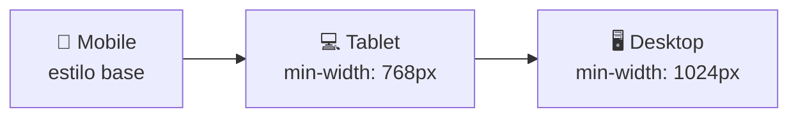

# Aula 04 — Design Responsivo e Mobile First

!!! info "Objetivos da aula"
    - Diferenciar layout **responsivo** de **adaptativo**.
    - Escrever **media queries** eficazes.
    - Adotar a estratégia **Mobile First**.

## Responsivo x Adaptativo

=== "Responsivo (fluido)"
    Um **único** layout que se estica e encolhe continuamente, usando unidades relativas (`%`, `fr`, `rem`) e media queries. É a abordagem padrão hoje.

=== "Adaptativo (fixo)"
    **Vários** layouts fixos, um para cada faixa de tela (breakpoint). O site "salta" de um layout para outro. Mais previsível, porém rígido.

| Critério | Responsivo | Adaptativo |
| :------- | :--------- | :--------- |
| Layouts | Um, fluido | Vários, fixos |
| Transição | Suave | Em degraus |
| Manutenção | Mais simples | Mais trabalhosa |

## Mobile First: por que começar pequeno?



Você escreve primeiro o layout do celular (o mais restritivo) e vai **adicionando** complexidade conforme a tela cresce. Isso resulta em CSS mais limpo e melhor desempenho no mobile.

!!! tip "Mobile First = min-width"
    Em Mobile First usamos `min-width` nas media queries ("a partir de tal largura, aplique isto"). O caminho oposto (`max-width`) é *Desktop First*.

## Media queries

```css
/* Estilo base: celular (nada de media query) */
.container { display: block; }

/* Tablet para cima */
@media (min-width: 768px) {
  .container {
    display: grid;
    grid-template-columns: 1fr 1fr;
  }
}

/* Desktop para cima */
@media (min-width: 1024px) {
  .container {
    grid-template-columns: repeat(3, 1fr);
  }
}
```

Breakpoints comuns (use como referência, não como dogma):

| Dispositivo | Largura sugerida |
| :---------- | :--------------- |
| Celular | base (< 768px) |
| Tablet | ≥ 768px |
| Desktop | ≥ 1024px |
| Telas grandes | ≥ 1440px |

## Imagens e mídia fluidas

```css
img {
  max-width: 100%;
  height: auto;
}
```

!!! warning "Não esqueça o viewport"
    Nada disso funciona sem a meta tag vista na Aula 01:
    ```html
    <meta name="viewport" content="width=device-width, initial-scale=1.0" />
    ```

## Unidades relativas: a base do fluido

Layouts responsivos raramente usam `px` para tamanhos que precisam se adaptar. Prefira unidades relativas:

| Unidade | Relativa a... | Bom para |
| :------ | :------------ | :------- |
| `%` | tamanho do elemento pai | larguras |
| `rem` | tamanho da fonte raiz (`html`) | fontes, espaçamentos |
| `em` | tamanho da fonte do próprio elemento | *padding* de botões |
| `vw` / `vh` | 1% da largura / altura da janela | seções em tela cheia |

```css
.container {
  width: 90%;
  max-width: 1200px; /* mas nunca maior que isso */
  margin: 0 auto;    /* centraliza */
}
```

!!! tip "`clamp()`: tipografia fluida sem media query"
    A função `clamp(mínimo, ideal, máximo)` faz o valor crescer com a tela até um teto:
    ```css
    h1 { font-size: clamp(1.5rem, 4vw, 3rem); }
    ```
    A fonte nunca fica menor que `1.5rem` nem maior que `3rem`.

## Escolhendo breakpoints

Não decore larguras de aparelhos específicos — eles mudam toda hora. **Deixe o conteúdo dizer onde quebrar**: redimensione a janela e, quando o layout "ficar feio", ali está seu breakpoint.

```css
/* Base: mobile */
.cards { grid-template-columns: 1fr; }

@media (min-width: 640px)  { .cards { grid-template-columns: repeat(2, 1fr); } }
@media (min-width: 1024px) { .cards { grid-template-columns: repeat(4, 1fr); } }
```

!!! warning "Ordem importa em Mobile First"
    Como usamos `min-width`, coloque as media queries em ordem **crescente** de largura. Uma regra de `1024px` declarada antes de `640px` pode ser sobrescrita indevidamente.

## O menu hambúrguer (visual)

No Exercício 2, a técnica é mostrar/esconder conforme a tela:

```css
/* Mobile: esconde os links, mostra o ícone */
.menu-links { display: none; }
.hamburguer { display: block; }

/* Desktop: mostra os links, esconde o ícone */
@media (min-width: 768px) {
  .menu-links { display: flex; }
  .hamburguer { display: none; }
}
```

(A abertura do menu ao clicar virá com JavaScript, na Aula 09.)

## Imagens responsivas de verdade

Além de `max-width: 100%`, você pode servir tamanhos diferentes por tela, economizando dados no celular:

```html

```

## Exercícios

??? abstract "Exercício 1 — Grid que responde"
    Crie uma galeria de cards: 1 coluna no celular, 2 no tablet e 4 no desktop, controlando **apenas** com media queries `min-width`.

??? abstract "Exercício 2 — Menu hambúrguer (visual)"
    Faça um menu que aparece na horizontal no desktop e, no celular, esconde os links (deixe o ícone ☰ visível). Ainda sem JS — apenas mostrando/ocultando com media query.

??? abstract "Exercício 3 — Teste no DevTools"
    Pegue a galeria do Exercício 1 e teste no **modo dispositivo** do DevTools (`Ctrl+Shift+M`). Tire prints em 3 larguras diferentes e descreva o que muda.

!!! tip "Próxima Parada"
    Você já entrega interfaces bonitas e adaptáveis — mas serão **fáceis de usar**? Na próxima aula entramos em UI/UX. Antes, resolva a 👉 [**Lista 04**](../listas/04-lista.md).

## 📚 Referências

- [MDN — Design responsivo](https://developer.mozilla.org/pt-BR/docs/Learn/CSS/CSS_layout/Responsive_Design)
- [MDN — Media queries](https://developer.mozilla.org/pt-BR/docs/Web/CSS/CSS_media_queries/Using_media_queries)
- [web.dev — Learn Responsive Design](https://web.dev/learn/design/)
- [MDN — Imagens responsivas (`srcset`/`sizes`)](https://developer.mozilla.org/pt-BR/docs/Learn/HTML/Multimedia_and_embedding/Responsive_images)
- [MDN — `clamp()`](https://developer.mozilla.org/pt-BR/docs/Web/CSS/clamp)
