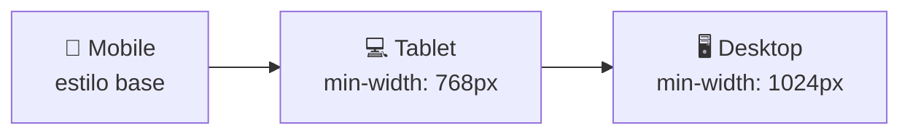

# Aula 04 — Design Responsivo e Mobile First

!!! info "Objetivos da aula"
    - Diferenciar layout **responsivo** de **adaptativo**.
    - Escrever **media queries** eficazes.
    - Adotar a estratégia **Mobile First**.

## Responsivo x Adaptativo

=== "Responsivo (fluido)"
    Um **único** layout que se estica e encolhe continuamente, usando unidades relativas (`%`, `fr`, `rem`) e media queries. É a abordagem padrão hoje.

=== "Adaptativo (fixo)"
    **Vários** layouts fixos, um para cada faixa de tela (breakpoint). O site "salta" de um layout para outro. Mais previsível, porém rígido.

| Critério | Responsivo | Adaptativo |
| :------- | :--------- | :--------- |
| Layouts | Um, fluido | Vários, fixos |
| Transição | Suave | Em degraus |
| Manutenção | Mais simples | Mais trabalhosa |

## Mobile First: por que começar pequeno?



Você escreve primeiro o layout do celular (o mais restritivo) e vai **adicionando** complexidade conforme a tela cresce. Isso resulta em CSS mais limpo e melhor desempenho no mobile.

!!! tip "Mobile First = min-width"
    Em Mobile First usamos `min-width` nas media queries ("a partir de tal largura, aplique isto"). O caminho oposto (`max-width`) é *Desktop First*.

## Media queries

```css
/* Estilo base: celular (nada de media query) */
.container { display: block; }

/* Tablet para cima */
@media (min-width: 768px) {
  .container {
    display: grid;
    grid-template-columns: 1fr 1fr;
  }
}

/* Desktop para cima */
@media (min-width: 1024px) {
  .container {
    grid-template-columns: repeat(3, 1fr);
  }
}
```

Breakpoints comuns (use como referência, não como dogma):

| Dispositivo | Largura sugerida |
| :---------- | :--------------- |
| Celular | base (< 768px) |
| Tablet | ≥ 768px |
| Desktop | ≥ 1024px |
| Telas grandes | ≥ 1440px |

## Imagens e mídia fluidas

```css
img {
  max-width: 100%;
  height: auto;
}
```

!!! warning "Não esqueça o viewport"
    Nada disso funciona sem a meta tag vista na Aula 01:
    ```html
    <meta name="viewport" content="width=device-width, initial-scale=1.0" />
    ```

## Exercícios

??? abstract "Exercício 1 — Grid que responde"
    Crie uma galeria de cards: 1 coluna no celular, 2 no tablet e 4 no desktop, controlando **apenas** com media queries `min-width`.

??? abstract "Exercício 2 — Menu hambúrguer (visual)"
    Faça um menu que aparece na horizontal no desktop e, no celular, esconde os links (deixe o ícone ☰ visível). Ainda sem JS — apenas mostrando/ocultando com media query.

??? abstract "Exercício 3 — Teste no DevTools"
    Pegue a galeria do Exercício 1 e teste no **modo dispositivo** do DevTools (`Ctrl+Shift+M`). Tire prints em 3 larguras diferentes e descreva o que muda.

!!! tip "Próxima Parada"
    Você já entrega interfaces bonitas e adaptáveis — mas serão **fáceis de usar**? Na próxima aula entramos em UI/UX. Antes, resolva a 👉 [**Lista 04**](../listas/04-lista.md).
