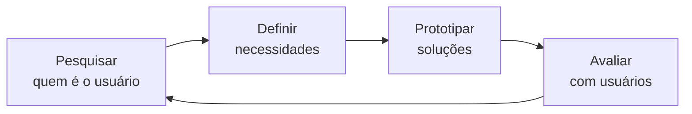

# Aula 05 — UI/UX: Usabilidade e Design Centrado no Usuário

!!! info "Objetivos da aula"
    - Diferenciar **UI** de **UX**.
    - Conhecer as **10 heurísticas de Nielsen**.
    - Aplicar o **Design Centrado no Usuário (DCU)**.

## UI x UX: não são a mesma coisa

=== "UI — User Interface"
    O **que você vê e toca**: cores, botões, tipografia, ícones, espaçamento. É a camada visual.

=== "UX — User Experience"
    O **que você sente ao usar**: é fácil? é rápido? me frustrei? A experiência completa, do primeiro clique ao objetivo cumprido.

!!! quote "Analogia"
    Se o produto fosse um restaurante, a **UI** é a decoração e a louça; a **UX** é toda a experiência: reserva, atendimento, sabor e a conta no fim.

## As 10 heurísticas de Nielsen

| # | Heurística | Em uma frase |
| :- | :--------- | :----------- |
| 1 | Visibilidade do status | Mostre o que está acontecendo (loading, sucesso). |
| 2 | Correspondência com o mundo real | Fale a língua do usuário. |
| 3 | Controle e liberdade | Ofereça "desfazer" e "voltar". |
| 4 | Consistência e padrões | Não reinvente convenções. |
| 5 | Prevenção de erros | Evite que o erro aconteça. |
| 6 | Reconhecer > lembrar | Deixe opções visíveis. |
| 7 | Flexibilidade e eficiência | Atalhos para experientes. |
| 8 | Design minimalista | Menos é mais. |
| 9 | Ajudar a reconhecer/recuperar de erros | Mensagens claras e com solução. |
| 10 | Ajuda e documentação | Disponível quando necessária. |

!!! example "Heurística 1 na prática"
    Um botão "Enviar" que, ao ser clicado, mostra um *spinner* e depois "✅ Enviado!" respeita a **visibilidade do status**. Um botão que parece não fazer nada quebra essa heurística.

## Design Centrado no Usuário (DCU)

O DCU é **iterativo**: você projeta, testa com pessoas reais, aprende e repete. Decisões são baseadas em **evidências**, não em achismos.

Ferramentas do DCU:

- **Personas** — arquétipos dos usuários.
- **Jornada do usuário** — os passos até o objetivo.
- **Testes de usabilidade** — observar pessoas usando o produto.

## Boas práticas de UI

!!! tip "Checklist rápido"
    - **Hierarquia visual**: o mais importante deve saltar aos olhos.
    - **Contraste**: texto legível sobre o fundo.
    - **Feedback**: todo clique gera uma resposta visível.
    - **Alvos de toque** ≥ 44×44px no mobile.
    - **Consistência**: mesmos padrões em todo o produto.

## Exercícios

??? abstract "Exercício 1 — Caça às heurísticas"
    Escolha um app ou site que você usa. Liste **3 boas** práticas (heurísticas respeitadas) e **3 problemas** (heurísticas violadas), citando o número da heurística em cada caso.

??? abstract "Exercício 2 — Persona"
    Crie uma persona para um app de sua escolha: nome, idade, objetivos, frustrações e contexto de uso. Explique como ela influenciaria uma decisão de design.

??? abstract "Exercício 3 — Redesenho"
    Encontre um formulário confuso (real ou inventado) e proponha uma versão melhorada, justificando cada mudança com a heurística correspondente.

!!! tip "Próxima Parada"
    Usável para a maioria é ótimo — mas e para **todos**? Na próxima aula garantimos acessibilidade. Antes, resolva a 👉 [**Lista 05**](../listas/05-lista.md).
