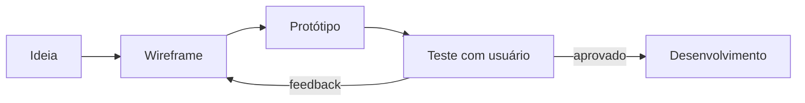

# Aula 07 — Prototipagem e Avaliação de Interfaces

!!! info "Objetivos da aula"
    - Entender os níveis de fidelidade de um protótipo.
    - Criar **wireframes** e protótipos navegáveis.
    - Avaliar interfaces com **testes de usabilidade**.

## Por que prototipar antes de codar?

Mudar um traço no papel custa segundos; mudar código pronto custa horas. Prototipar permite **errar barato** e validar ideias com usuários **antes** de investir em desenvolvimento.

## Níveis de fidelidade

=== "Baixa fidelidade"
    Rascunhos em papel ou blocos cinzas. Foco em **estrutura e fluxo**, sem cores nem conteúdo real. Rápido e descartável.

=== "Média fidelidade"
    **Wireframes** digitais: layout, hierarquia e navegação já definidos, ainda em tons de cinza.

=== "Alta fidelidade"
    Protótipo com cores, tipografia, conteúdo real e **interações clicáveis**. Quase idêntico ao produto final.

| Fidelidade | Custo | Quando usar |
| :--------- | :---- | :---------- |
| Baixa | Baixo | Explorar muitas ideias |
| Média | Médio | Alinhar estrutura |
| Alta | Alto | Validar antes de codar / vender a ideia |

## Ferramentas

- **Figma** — padrão de mercado, colaborativo e gratuito para estudar.
- **Excalidraw / papel** — para baixa fidelidade rápida.

!!! tip "Comece pelo fluxo"
    Antes das telas, desenhe o **fluxo**: quais telas existem e como o usuário navega entre elas. Uma tela linda no lugar errado do fluxo não resolve nada.

## Avaliação de interfaces

Duas famílias de métodos:

=== "Avaliação por especialistas"
    **Avaliação heurística** (Aula 05): especialistas percorrem a interface checando as heurísticas de Nielsen. Rápida e barata, mas não substitui usuários reais.

=== "Avaliação com usuários"
    **Teste de usabilidade**: pessoas reais executam tarefas enquanto você observa. Revela problemas que nenhum especialista previu.

## Rodando um teste de usabilidade simples

1. Defina **tarefas** claras (ex.: "compre um ingresso").
2. Convide de **3 a 5 usuários** — já revelam a maioria dos problemas.
3. Peça para **pensarem em voz alta** enquanto usam.
4. **Observe e anote**; não ajude nem explique.
5. Meça: concluiu a tarefa? em quanto tempo? onde travou?

!!! warning "Teste tarefas, não pessoas"
    Deixe claro: "estamos testando o **produto**, não você". Se o usuário errar, o problema é do design.

## Conceitos-chave do Figma

Para os Exercícios 1 e 2, você precisa dominar quatro conceitos do Figma:

| Conceito | O que é |
| :------- | :------ |
| **Frame** | Uma "tela" (ex.: um celular 390×844) onde você desenha |
| **Componente** | Um elemento reutilizável (botão, card); editar o mestre atualiza todas as cópias |
| **Auto Layout** | Faz o conteúdo se ajustar sozinho, como o Flexbox |
| **Prototype** | A aba que liga elementos a telas de destino, criando a navegação |

!!! tip "Do wireframe ao clicável"
    Desenhe cada tela em um **Frame**. Depois, na aba **Prototype**, arraste uma "setinha" de um botão até a tela de destino e escolha a interação (*On click → Navigate to*). Pronto: seu wireframe virou protótipo navegável.

## Anatomia de um wireframe

Um bom wireframe de média fidelidade mostra, sem cores nem conteúdo final:

- **Hierarquia**: o que é título, o que é ação principal.
- **Blocos de conteúdo**: retângulos representando imagens, listas, cards.
- **Navegação**: onde estão menu, botão de voltar, ações.
- **Estados**: lista vazia, carregando, erro (não só o "caminho feliz").

## Métodos de teste (Exercício 3)

=== "Moderado x não moderado"
    - **Moderado:** um facilitador acompanha em tempo real e pode fazer perguntas.
    - **Não moderado:** o usuário faz sozinho; escala melhor, mas você perde o "porquê".

=== "O que medir"
    | Métrica | Pergunta |
    | :------ | :------- |
    | Taxa de sucesso | Concluiu a tarefa? |
    | Tempo na tarefa | Quanto demorou? |
    | Nº de erros | Onde/quantas vezes travou? |
    | Satisfação | Como se sentiu? (1 a 5) |

!!! info "Protocolo *think aloud* (pensar em voz alta)"
    Peça que o usuário **narre o que pensa** enquanto usa: "estou procurando o botão de comprar... não acho...". Esses comentários revelam os problemas de UX que as métricas sozinhas não mostram.

## Exercícios

??? abstract "Exercício 1 — Wireframe"
    Desenhe (papel ou Figma) o wireframe de **3 telas** de um app: lista, detalhe e formulário. Indique com setas o fluxo de navegação entre elas.

??? abstract "Exercício 2 — Protótipo navegável"
    No Figma, torne o wireframe do Exercício 1 clicável: ligue os botões às telas de destino. Compartilhe o link do protótipo.

??? abstract "Exercício 3 — Roteiro de teste"
    Escreva um roteiro de teste de usabilidade para seu protótipo: 3 tarefas, o que observar e como medir sucesso. (Bônus: aplique com um colega.)

!!! tip "Próxima Parada"
    Com a interface projetada e validada, é hora de dar **comportamento** a ela: entra o JavaScript! Antes, resolva a 👉 [**Lista 07**](../listas/07-lista.md).

## 📚 Referências

- [Central de Ajuda do Figma](https://help.figma.com/hc/pt-br)
- [Nielsen Norman Group — Prototipagem](https://www.nngroup.com/articles/ux-prototype-hi-lo-fidelity/)
- [Nielsen Norman Group — Testes de usabilidade](https://www.nngroup.com/articles/usability-testing-101/)
- [Interaction Design Foundation — Prototyping](https://www.interaction-design.org/literature/topics/prototyping)
- [Nielsen Norman Group — Por que 5 usuários bastam](https://www.nngroup.com/articles/why-you-only-need-to-test-with-5-users/)
