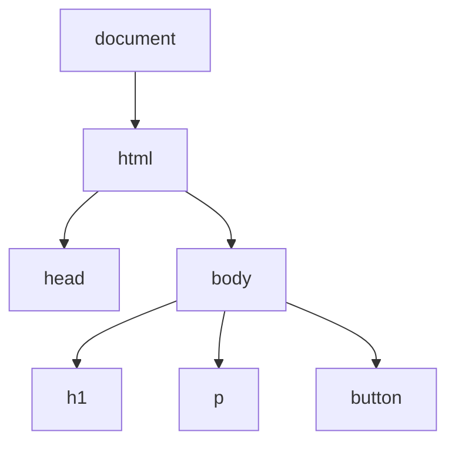

# Aula 09 — JavaScript: DOM e Eventos

!!! info "Objetivos da aula"
    - Entender o que é o **DOM**.
    - **Selecionar** e **modificar** elementos da página.
    - Reagir a **eventos** do usuário.

## O que é o DOM?

O **DOM** (Document Object Model) é a representação da página como uma **árvore de objetos** que o JavaScript pode ler e alterar em tempo real.



## Selecionando elementos

```js
// por seletor CSS (o mais usado)
const titulo = document.querySelector("h1");
const itens = document.querySelectorAll(".item"); // lista

// por id
const caixa = document.getElementById("caixa");
```

!!! tip "querySelector aceita qualquer seletor CSS"
    `document.querySelector("nav ul li.ativo")` funciona igual ao CSS. Se souber estilizar, você já sabe selecionar.

## Modificando a página

```js
const titulo = document.querySelector("h1");

titulo.textContent = "Novo título";        // texto
titulo.style.color = "purple";             // estilo inline
titulo.classList.add("destaque");          // classe CSS
titulo.classList.toggle("ativo");          // liga/desliga
```

=== "Criando elementos"
    ```js
    const li = document.createElement("li");
    li.textContent = "Item novo";
    document.querySelector("ul").appendChild(li);
    ```

=== "Removendo"
    ```js
    document.querySelector(".item").remove();
    ```

!!! warning "Prefira classList a style"
    Em vez de setar vários `element.style.*` no JS, defina uma classe no CSS e use `classList.add/toggle`. Mantém a apresentação no CSS, onde ela deve estar.

## Eventos

Eventos são ações do usuário (clique, digitação, envio) às quais reagimos com funções.

```js
const botao = document.querySelector("#salvar");

botao.addEventListener("click", () => {
  alert("Salvo!");
});
```

Eventos comuns:

| Evento | Dispara quando... |
| :----- | :---------------- |
| `click` | o elemento é clicado |
| `input` | o valor de um campo muda |
| `submit` | um formulário é enviado |
| `keydown` | uma tecla é pressionada |
| `mouseover` | o mouse entra no elemento |

## Exemplo completo: contador

```html
<p>Cliques: <span id="valor">0</span></p>
<button id="btn">Clique aqui</button>

<script>
  let contador = 0;
  const valor = document.querySelector("#valor");

  document.querySelector("#btn").addEventListener("click", () => {
    contador++;
    valor.textContent = contador;
  });
</script>
```

!!! example "Formulário sem recarregar"
    ```js
    const form = document.querySelector("form");
    form.addEventListener("submit", (evento) => {
      evento.preventDefault(); // impede o recarregamento
      const nome = document.querySelector("#nome").value;
      console.log("Olá,", nome);
    });
    ```

## Exercícios

??? abstract "Exercício 1 — Alternador de tema"
    Crie um botão que alterne uma classe `dark` no `<body>`, trocando as cores da página (defina o tema escuro no CSS).

??? abstract "Exercício 2 — Lista de tarefas"
    Faça um campo de texto e um botão "Adicionar" que insere o texto digitado como um novo `<li>` em uma lista. Cada item deve ter um botão para removê-lo.

??? abstract "Exercício 3 — Validação ao vivo"
    Em um campo de senha, use o evento `input` para mostrar em tempo real se a senha tem pelo menos 8 caracteres (texto verde/vermelho, mais um ícone — não só cor!).

!!! tip "Próxima Parada"
    Sua página já reage ao usuário — agora vamos buscar dados da internet com JavaScript **assíncrono**. Antes, resolva a 👉 [**Lista 09**](../listas/09-lista.md).
