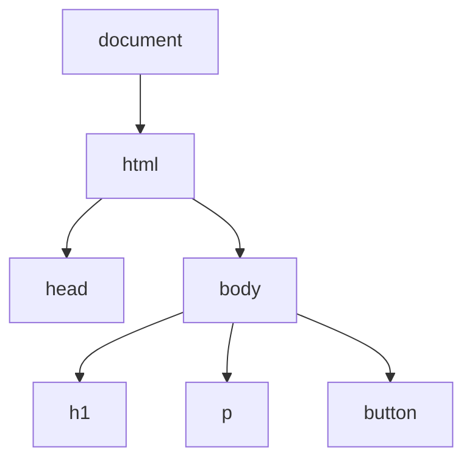

# Aula 09 — JavaScript: DOM e Eventos

!!! info "Objetivos da aula"
    - Entender o que é o **DOM**.
    - **Selecionar** e **modificar** elementos da página.
    - Reagir a **eventos** do usuário.

## O que é o DOM?

O **DOM** (Document Object Model) é a representação da página como uma **árvore de objetos** que o JavaScript pode ler e alterar em tempo real.



## Selecionando elementos

```js
// por seletor CSS (o mais usado)
const titulo = document.querySelector("h1");
const itens = document.querySelectorAll(".item"); // lista

// por id
const caixa = document.getElementById("caixa");
```

!!! tip "querySelector aceita qualquer seletor CSS"
    `document.querySelector("nav ul li.ativo")` funciona igual ao CSS. Se souber estilizar, você já sabe selecionar.

## Modificando a página

```js
const titulo = document.querySelector("h1");

titulo.textContent = "Novo título";        // texto
titulo.style.color = "purple";             // estilo inline
titulo.classList.add("destaque");          // classe CSS
titulo.classList.toggle("ativo");          // liga/desliga
```

=== "Criando elementos"
    ```js
    const li = document.createElement("li");
    li.textContent = "Item novo";
    document.querySelector("ul").appendChild(li);
    ```

=== "Removendo"
    ```js
    document.querySelector(".item").remove();
    ```

!!! warning "Prefira classList a style"
    Em vez de setar vários `element.style.*` no JS, defina uma classe no CSS e use `classList.add/toggle`. Mantém a apresentação no CSS, onde ela deve estar.

## Eventos

Eventos são ações do usuário (clique, digitação, envio) às quais reagimos com funções.

```js
const botao = document.querySelector("#salvar");

botao.addEventListener("click", () => {
  alert("Salvo!");
});
```

Eventos comuns:

| Evento | Dispara quando... |
| :----- | :---------------- |
| `click` | o elemento é clicado |
| `input` | o valor de um campo muda |
| `submit` | um formulário é enviado |
| `keydown` | uma tecla é pressionada |
| `mouseover` | o mouse entra no elemento |

## Exemplo completo: contador

```html
<p>Cliques: <span id="valor">0</span></p>
<button id="btn">Clique aqui</button>

<script>
  let contador = 0;
  const valor = document.querySelector("#valor");

  document.querySelector("#btn").addEventListener("click", () => {
    contador++;
    valor.textContent = contador;
  });
</script>
```

!!! example "Formulário sem recarregar"
    ```js
    const form = document.querySelector("form");
    form.addEventListener("submit", (evento) => {
      evento.preventDefault(); // impede o recarregamento
      const nome = document.querySelector("#nome").value;
      console.log("Olá,", nome);
    });
    ```

## O objeto do evento

Toda função de evento recebe um objeto com informações sobre o que aconteceu:

```js
input.addEventListener("input", (evento) => {
  console.log(evento.target);       // o elemento que disparou
  console.log(evento.target.value); // o valor digitado
  console.log(evento.type);         // "input"
});
```

| Propriedade / método | Uso |
| :------------------- | :-- |
| `evento.target` | Elemento que originou o evento |
| `evento.target.value` | Valor de um campo de formulário |
| `evento.key` | Tecla pressionada (em `keydown`) |
| `evento.preventDefault()` | Cancela o comportamento padrão |

!!! tip "Lendo o que o usuário digitou (Exercício 3)"
    Para a validação de senha ao vivo, escute o evento `input` e leia `evento.target.value.length`. Ele dispara a **cada tecla**, diferente do `change` (que só dispara ao sair do campo).

## Delegação de eventos

No Exercício 2 (todo-list), cada item novo precisa de um botão "remover". Em vez de adicionar um listener a cada botão, adicione **um só** na lista e descubra o clique pelo `target`:

```js
lista.addEventListener("click", (evento) => {
  if (evento.target.matches(".remover")) {
    evento.target.closest("li").remove();
  }
});
```

Isso é **delegação**: funciona até para elementos criados **depois**, e é mais eficiente.

## Guardando dados no HTML: `dataset`

Atributos `data-*` armazenam informações no próprio elemento, úteis para saber "qual item" foi clicado:

```html
<button class="remover" data-id="42">Remover</button>
```

```js
const id = evento.target.dataset.id; // "42"
```

## Criando muitos elementos com eficiência

Montar HTML por concatenação é rápido de escrever:

```js
lista.innerHTML = tarefas
  .map((t) => `<li>${t} <button class="remover">✕</button></li>`)
  .join("");
```

!!! warning "`innerHTML` e segurança"
    Nunca insira texto vindo do usuário direto em `innerHTML` sem tratamento — isso abre brecha para **XSS** (injeção de script). Para texto simples, prefira `textContent`, que não interpreta HTML.

## Exercícios

??? abstract "Exercício 1 — Alternador de tema"
    Crie um botão que alterne uma classe `dark` no `<body>`, trocando as cores da página (defina o tema escuro no CSS).

??? abstract "Exercício 2 — Lista de tarefas"
    Faça um campo de texto e um botão "Adicionar" que insere o texto digitado como um novo `<li>` em uma lista. Cada item deve ter um botão para removê-lo.

??? abstract "Exercício 3 — Validação ao vivo"
    Em um campo de senha, use o evento `input` para mostrar em tempo real se a senha tem pelo menos 8 caracteres (texto verde/vermelho, mais um ícone — não só cor!).

!!! tip "Próxima Parada"
    Sua página já reage ao usuário — agora vamos buscar dados da internet com JavaScript **assíncrono**. Antes, resolva a 👉 [**Lista 09**](../listas/09-lista.md).

## 📚 Referências

- [MDN — Manipulando documentos (DOM)](https://developer.mozilla.org/pt-BR/docs/Learn/JavaScript/Client-side_web_APIs/Manipulating_documents)
- [MDN — Introdução a eventos](https://developer.mozilla.org/pt-BR/docs/Learn/JavaScript/Building_blocks/Events)
- [MDN — Referência do DOM](https://developer.mozilla.org/pt-BR/docs/Web/API/Document_Object_Model)
- [javascript.info — Documento e eventos](https://javascript.info/document)
- [MDN — Segurança e XSS](https://developer.mozilla.org/pt-BR/docs/Web/Security/Types_of_attacks#cross-site_scripting_xss)
