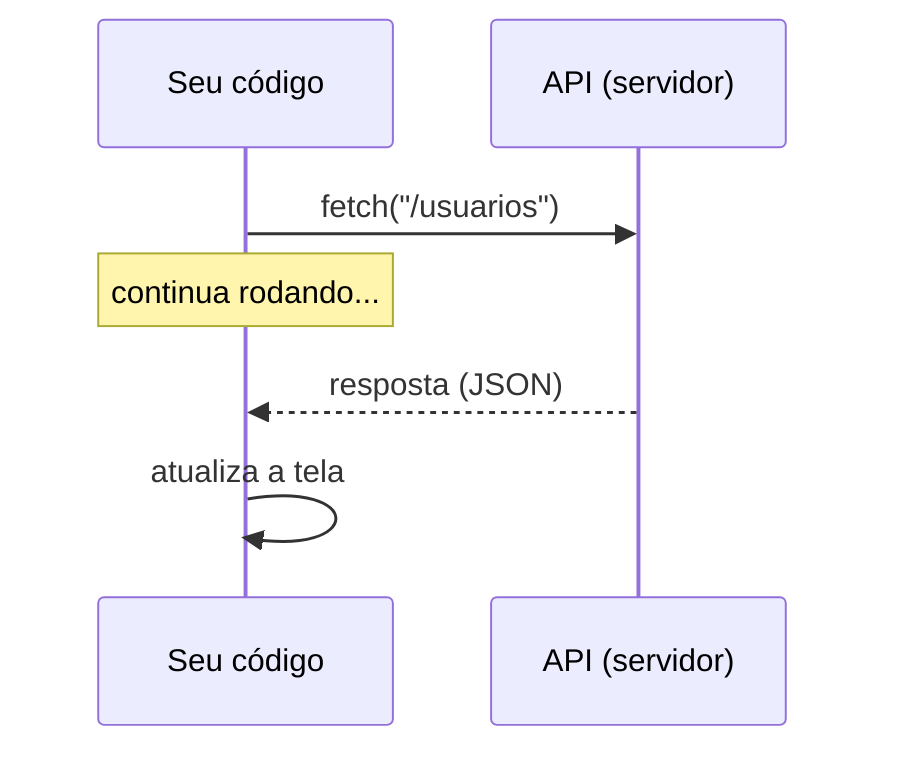
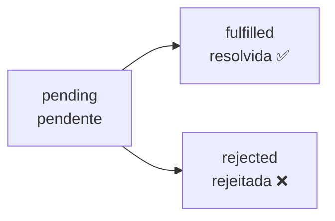

# Aula 10 — JavaScript Assíncrono e Consumo de APIs

!!! info "Objetivos da aula"
    - Entender código **síncrono x assíncrono**.
    - Usar **Promises** e **async/await**.
    - Consumir uma **API** com `fetch` e renderizar os dados.

## Síncrono x assíncrono

Código **síncrono** roda linha a linha, esperando cada uma terminar. Buscar dados na internet pode demorar — se fosse síncrono, a página **congelaria**. Por isso essas operações são **assíncronas**: o JS dispara a tarefa e segue em frente, tratando o resultado quando ele chega.



## O que é uma API?

Uma **API** (Application Programming Interface) é um "cardápio" de dados/serviços que um servidor expõe. Você faz uma requisição HTTP a uma **URL (endpoint)** e recebe uma resposta, quase sempre em **JSON**.

```json
{ "id": 1, "nome": "Ana", "email": "ana@exemplo.com" }
```

## fetch com async/await

```js
async function buscarUsuarios() {
  try {
    const resposta = await fetch("https://jsonplaceholder.typicode.com/users");
    if (!resposta.ok) throw new Error("Erro " + resposta.status);
    const usuarios = await resposta.json();
    console.log(usuarios);
  } catch (erro) {
    console.error("Falhou:", erro.message);
  }
}

buscarUsuarios();
```

=== "async/await (recomendado)"
    ```js
    const resposta = await fetch(url);
    const dados = await resposta.json();
    ```
    Lê-se de cima para baixo, como código síncrono.

=== "then/catch (Promises)"
    ```js
    fetch(url)
      .then((r) => r.json())
      .then((dados) => console.log(dados))
      .catch((e) => console.error(e));
    ```
    A forma mais antiga; você ainda vai encontrá-la por aí.

!!! warning "Sempre trate erros"
    Redes falham. Envolva `fetch` em `try/catch` e verifique `resposta.ok` — um `404` **não** dispara erro automaticamente no `fetch`.

## Renderizando os dados na tela

```js
async function listarUsuarios() {
  const resposta = await fetch("https://jsonplaceholder.typicode.com/users");
  const usuarios = await resposta.json();
  const ul = document.querySelector("#lista");

  usuarios.forEach((u) => {
    const li = document.createElement("li");
    li.textContent = `${u.name} — ${u.email}`;
    ul.appendChild(li);
  });
}

listarUsuarios();
```

!!! tip "UX enquanto carrega"
    Mostre um "Carregando..." antes do `await` e troque pelo conteúdo quando os dados chegarem. Lembra da **heurística 1** (visibilidade do status)?

## Verbos HTTP

| Verbo | Uso |
| :---- | :-- |
| `GET` | Ler dados |
| `POST` | Criar |
| `PUT`/`PATCH` | Atualizar |
| `DELETE` | Remover |

```js
await fetch(url, {
  method: "POST",
  headers: { "Content-Type": "application/json" },
  body: JSON.stringify({ nome: "Nova" }),
});
```

## Promises: os três estados

Uma **Promise** é uma "promessa" de um valor futuro. Ela vive em um de três estados:



`await` **pausa** a função até a Promise resolver (ou lançar erro, capturado pelo `catch`). Por baixo dos panos, `async/await` é só uma forma mais legível de lidar com Promises.

## JSON: o idioma das APIs

APIs trocam texto no formato **JSON**. Duas funções fazem a ponte com objetos JS:

```js
const obj = JSON.parse('{"nome":"Ana"}'); // texto  → objeto
const txt = JSON.stringify({ nome: "Ana" }); // objeto → texto
```

!!! info "`resposta.json()` já faz o parse"
    Ao chamar `await resposta.json()`, o `fetch` lê o corpo da resposta **e** converte o JSON em objeto de uma vez. Você raramente precisa de `JSON.parse` manual com `fetch`.

## Montando a URL do Exercício 1

O buscador de CEP concatena o valor digitado na URL da API:

```js
const cep = document.querySelector("#cep").value.replace(/\D/g, ""); // só dígitos
const resposta = await fetch(`https://viacep.com.br/ws/${cep}/json/`);
const dados = await resposta.json();

if (dados.erro) {
  console.log("CEP não encontrado");
} else {
  console.log(dados.logradouro, dados.bairro, dados.localidade);
}
```

!!! warning "Nem todo erro é uma exceção"
    O ViaCEP responde `200 OK` com `{ "erro": true }` para CEP inexistente. Ou seja: verifique **os dados**, não só o status HTTP.

## O padrão "carregando → dados → erro"

Toda tela que consome API deveria ter três estados visíveis (Exercício 2):

```js
async function carregar() {
  const alvo = document.querySelector("#conteudo");
  alvo.textContent = "Carregando..."; // 1. estado de carregamento
  try {
    const r = await fetch(url);
    if (!r.ok) throw new Error("Erro " + r.status);
    const dados = await r.json();
    alvo.innerHTML = renderizar(dados);  // 2. sucesso
  } catch (e) {
    alvo.textContent = "Não foi possível carregar. Tente novamente."; // 3. erro
  }
}
```

## Bônus: várias requisições ao mesmo tempo

```js
const [usuarios, posts] = await Promise.all([
  fetch(urlUsuarios).then((r) => r.json()),
  fetch(urlPosts).then((r) => r.json()),
]);
```

!!! tip "O que é CORS?"
    Se o console acusar erro de **CORS**, é o navegador bloqueando uma resposta de outro domínio que não autorizou seu site. Não é um bug do seu código — escolha uma API que permita acesso público (como as usadas nos exercícios).

## Exercícios

??? abstract "Exercício 1 — Buscador de CEP"
    Usando a API pública **ViaCEP** (`https://viacep.com.br/ws/CEP/json/`), crie um campo onde o usuário digita um CEP e a página exibe a rua, o bairro e a cidade.

??? abstract "Exercício 2 — Galeria de posts"
    Consuma `https://jsonplaceholder.typicode.com/posts`, mostre um "Carregando...", e renderize os 10 primeiros posts como cards. Trate erros de rede.

??? abstract "Exercício 3 — Clima ou piadas"
    Escolha uma API pública gratuita e monte uma página que busca e exibe algo útil (ex.: uma piada aleatória, cotação, etc.), com estado de carregamento e tratamento de erro.

!!! tip "Próxima Parada"
    Seus projetos estão crescendo — hora de organizá-los com **Git, npm e Sass**. Antes, resolva a 👉 [**Lista 10**](../listas/10-lista.md).

## 📚 Referências

- [MDN — Buscando dados do servidor (Fetch)](https://developer.mozilla.org/pt-BR/docs/Learn/JavaScript/Client-side_web_APIs/Fetching_data)
- [MDN — Usando Promises](https://developer.mozilla.org/pt-BR/docs/Web/JavaScript/Guide/Using_promises)
- [javascript.info — Promises, async/await](https://javascript.info/async)
- [MDN — CORS](https://developer.mozilla.org/pt-BR/docs/Web/HTTP/CORS)
- APIs para praticar: [ViaCEP](https://viacep.com.br/) · [JSONPlaceholder](https://jsonplaceholder.typicode.com/) · [Public APIs](https://github.com/public-apis/public-apis)
