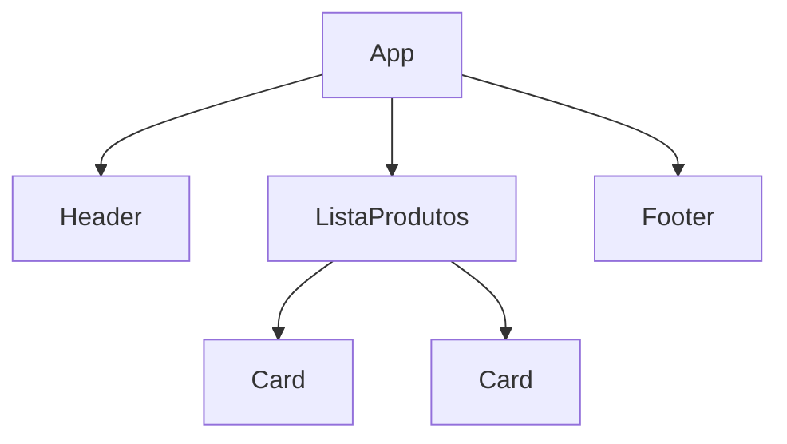
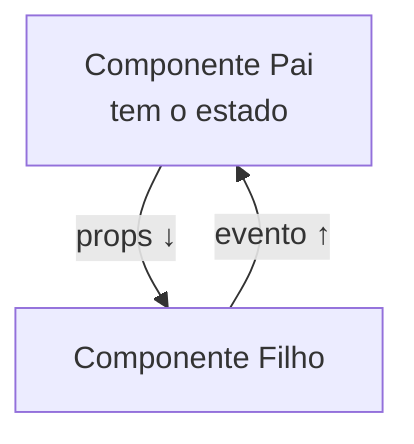

# Aula 12 — Frameworks Frontend e Componentização

!!! info "Objetivos da aula"
    - Entender o problema que os **frameworks** resolvem.
    - Compreender **componentes** e **estado**.
    - Criar um componente simples e reativo.

## Por que frameworks existem?

Manipular o DOM "na mão" (Aula 09) funciona em telas simples, mas vira um caos em apps grandes: muitos `querySelector`, atualizações espalhadas e bugs difíceis. **Frameworks** (React, Vue, Angular) resolvem isso com dois pilares: **componentes** e **reatividade**.



## Componentes: peças reutilizáveis

Um **componente** encapsula HTML + CSS + JS de um pedaço da interface (um card, um botão, um menu). Você o cria uma vez e reutiliza quantas vezes quiser, mudando só os **dados (props)**.

| Framework | Criador | Marca registrada |
| :-------- | :------ | :--------------- |
| **React** | Meta | JSX, enorme ecossistema |
| **Vue** | Comunidade | Curva de aprendizado suave |
| **Angular** | Google | Completo, "baterias inclusas" |

!!! info "Conceitos, não decoreba"
    Não importa qual framework você aprenda primeiro: **componentes, props, estado e renderização reativa** existem em todos. Dominar a ideia é o que transfere entre eles.

## Estado e reatividade

**Estado** são os dados que mudam ao longo do tempo (o texto de um campo, o total do carrinho). Quando o estado muda, o framework **re-renderiza automaticamente** só o necessário — você não mexe no DOM manualmente.

=== "Vanilla JS (manual)"
    ```js
    let contador = 0;
    botao.addEventListener("click", () => {
      contador++;
      span.textContent = contador; // você atualiza o DOM
    });
    ```

=== "React (reativo)"
    ```jsx
    function Contador() {
      const [n, setN] = useState(0);
      return <button onClick={() => setN(n + 1)}>Cliques: {n}</button>;
    }
    ```
    Você muda o **estado**; a tela se atualiza sozinha.

## Um gostinho de Vue

```html
<div id="app">
  <button @click="contador++">Cliques: {{ contador }}</button>
</div>

<script type="module">
  import { createApp } from "https://unpkg.com/vue@3/dist/vue.esm-browser.js";
  createApp({ data: () => ({ contador: 0 }) }).mount("#app");
</script>
```

!!! tip "Ferramenta de build"
    Projetos com framework usam um *bundler* como o **Vite** (`npm create vite@latest`), que dá servidor de desenvolvimento instantâneo e otimiza o código para produção.

## Props x Estado: a distinção-chave

Confundir os dois é o erro mais comum de quem começa. A regra:

| | **Props** | **Estado (state)** |
| :-- | :-------- | :----------------- |
| Vem de | Do componente **pai** | De **dentro** do próprio componente |
| Pode mudar? | **Não** (são só leitura) | **Sim** |
| Serve para | Configurar/personalizar | Guardar o que muda no tempo |

No Exercício 3, o "Card de produto" recebe nome, preço e imagem como **props** (dados que o pai passa). Já um contador guarda o número atual no seu **estado**.

## Fluxo de dados unidirecional

Os dados descem do pai para os filhos (via props); os filhos avisam o pai de mudanças por **eventos/callbacks**. Esse caminho único torna o app previsível.



## Renderizando listas (e o porquê da `key`)

O Exercício 3 renderiza uma lista de produtos. Frameworks pedem uma **`key`** única por item para saber o que mudou e re-renderizar só o necessário:

=== "Vue"
    ```html
    <li v-for="p in produtos" :key="p.id">{{ p.nome }} — R$ {{ p.preco }}</li>
    ```

=== "React"
    ```jsx
    {produtos.map((p) => (
      <li key={p.id}>{p.nome} — R$ {p.preco}</li>
    ))}
    ```

!!! warning "Não use o índice como `key`"
    Usar a posição do array (`index`) como `key` causa bugs quando a lista é reordenada ou filtrada. Prefira um identificador estável, como um `id`.

## O que é o Virtual DOM?

Mexer no DOM real é caro. React e Vue mantêm uma cópia leve em memória (o **Virtual DOM**), calculam a **diferença** após uma mudança de estado e aplicam no DOM real apenas o que realmente mudou. É isso que torna a UI reativa e rápida.

!!! info "SPA — Single Page Application"
    Apps com framework costumam ser **SPAs**: uma única página HTML cujo conteúdo é trocado via JavaScript, sem recarregar a página inteira a cada navegação — a mesma ideia do `navigation.instant` deste site.

## Exercícios

??? abstract "Exercício 1 — Pensando em componentes"
    Pegue uma página conhecida (ex.: uma loja online) e faça um diagrama dividindo-a em componentes. Indique quais props cada card/lista receberia.

??? abstract "Exercício 2 — Contador reativo"
    Usando Vue via CDN (ou React), crie um contador com botões "+" e "−" e um botão "zerar", tudo reagindo ao estado.

??? abstract "Exercício 3 — Lista com props"
    Crie um componente "Card de produto" que receba nome, preço e imagem por props, e renderize uma lista de 4 produtos reutilizando esse componente.

!!! tip "Próxima Parada"
    Do navegador para o **bolso**: na próxima aula levamos a web para dispositivos móveis com apps híbridos. Antes, resolva a 👉 [**Lista 12**](../listas/12-lista.md).

## 📚 Referências

- [Vue.js — Documentação oficial](https://vuejs.org/guide/introduction.html)
- [React — Documentação oficial (react.dev)](https://react.dev/learn)
- [MDN — Introdução a frameworks JavaScript](https://developer.mozilla.org/pt-BR/docs/Learn/Tools_and_testing/Client-side_JavaScript_frameworks/Introduction)
- [Vite — Ferramenta de build](https://vitejs.dev/guide/)
- [MDN — Componentes Web (padrão nativo)](https://developer.mozilla.org/pt-BR/docs/Web/API/Web_components)
