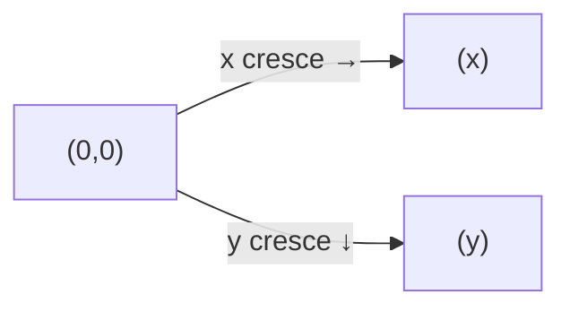

# Aula 14 — Matemática para Jogos

!!! info "Objetivos da aula"
    - Usar **coordenadas** e **vetores** no plano.
    - Aplicar **trigonometria** a movimento e rotação.
    - Entender **álgebra linear** básica para jogos.

## O plano do jogo

No Canvas (próxima aula), a origem `(0, 0)` fica no **canto superior esquerdo**. O eixo $x$ cresce para a direita e o eixo $y$ cresce **para baixo** — diferente da matemática escolar!



## Vetores: posição, velocidade e direção

Um **vetor** $\vec{v} = (x, y)$ representa deslocamento ou velocidade. Movimentar um objeto é somar sua velocidade à posição, quadro a quadro:

```js
const objeto = { x: 100, y: 50, vx: 2, vy: -1 };

function atualizar() {
  objeto.x += objeto.vx;
  objeto.y += objeto.vy;
}
```

**Magnitude** (comprimento) de um vetor:

$$ |\vec{v}| = \sqrt{x^2 + y^2} $$

```js
const magnitude = Math.sqrt(v.x ** 2 + v.y ** 2);
```

!!! tip "Normalizar = manter só a direção"
    Dividir um vetor pela sua magnitude gera um vetor de comprimento 1 (unitário). Útil para mover a uma velocidade constante em qualquer direção:
    ```js
    const m = Math.hypot(v.x, v.y);
    const dir = { x: v.x / m, y: v.y / m };
    ```

## Distância entre dois pontos

$$ d = \sqrt{(x_2 - x_1)^2 + (y_2 - y_1)^2} $$

```js
function distancia(a, b) {
  return Math.hypot(b.x - a.x, b.y - a.y);
}
```

Base para **colisão por círculos**: houve colisão se a distância entre os centros for menor que a soma dos raios.

```js
function colidem(a, b) {
  return distancia(a, b) < a.raio + b.raio;
}
```

## Trigonometria: ângulos e movimento

Para mover na direção de um ângulo $\theta$ (em radianos):

$$ v_x = \cos(\theta) \cdot velocidade \qquad v_y = \sin(\theta) \cdot velocidade $$

```js
const angulo = Math.PI / 4;   // 45°
const velocidade = 5;
const vx = Math.cos(angulo) * velocidade;
const vy = Math.sin(angulo) * velocidade;
```

!!! warning "Radianos, não graus"
    `Math.cos` e `Math.sin` usam **radianos**. Converta: `radianos = graus * Math.PI / 180`.

Para apontar um objeto **na direção do mouse**, use `atan2`:

```js
const angulo = Math.atan2(mouse.y - obj.y, mouse.x - obj.x);
```

## Álgebra linear na prática

Somar, escalar e interpolar vetores é o coração da movimentação:

| Operação | Fórmula | Uso no jogo |
| :------- | :------ | :---------- |
| Soma | $(a_x+b_x,\ a_y+b_y)$ | Aplicar velocidade |
| Escala | $(k \cdot x,\ k \cdot y)$ | Acelerar/frear |
| Interpolação (lerp) | $a + (b-a)\cdot t$ | Movimento/câmera suave |

```js
const lerp = (a, b, t) => a + (b - a) * t;   // t entre 0 e 1
camera.x = lerp(camera.x, alvo.x, 0.1);       // segue suave
```

## Exercícios

??? abstract "Exercício 1 — Distância e colisão"
    Escreva `distancia(a, b)` e `colidem(a, b)` (círculos) e teste com pares de pontos, imprimindo se colidem ou não.

??? abstract "Exercício 2 — Mira no alvo"
    Dado um objeto e um ponto-alvo, calcule `vx` e `vy` (usando `atan2`) para que o objeto se mova em linha reta até o alvo a uma velocidade fixa.

??? abstract "Exercício 3 — Movimento suave (lerp)"
    Implemente uma função que aproxime um valor de um alvo por interpolação. Simule 10 quadros imprimindo a posição a cada passo e observe a suavização.

!!! tip "Próxima Parada"
    Com a matemática na ponta dos dedos, vamos finalmente **desenhar e animar** com o Canvas. Antes, resolva a 👉 [**Lista 14**](../listas/14-lista.md).
