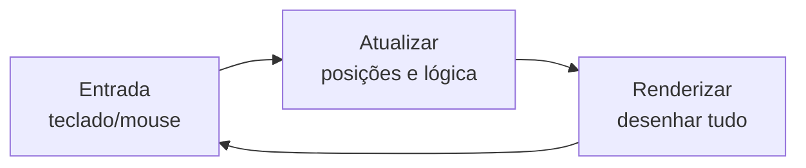

# Aula 15 — Computação Gráfica: Canvas e Game Loop

!!! info "Objetivos da aula"
    - Desenhar formas com a API **Canvas 2D**.
    - Estruturar um **game loop** com `requestAnimationFrame`.
    - Animar objetos e capturar **entrada** do teclado.

## O elemento Canvas

O `<canvas>` é uma "tela em branco" onde desenhamos via JavaScript, pixel a pixel.

```html
<canvas id="tela" width="480" height="320"></canvas>
```

```js
const canvas = document.querySelector("#tela");
const ctx = canvas.getContext("2d"); // o "pincel"
```

## Desenhando formas

```js
// retângulo preenchido
ctx.fillStyle = "#7c4dff";
ctx.fillRect(20, 20, 100, 60);

// círculo
ctx.beginPath();
ctx.arc(200, 100, 30, 0, Math.PI * 2);
ctx.fillStyle = "orange";
ctx.fill();

// texto
ctx.fillStyle = "black";
ctx.font = "20px Inter";
ctx.fillText("Placar: 0", 10, 300);
```

| Método | Desenha |
| :----- | :------ |
| `fillRect(x, y, w, h)` | Retângulo preenchido |
| `strokeRect(...)` | Só a borda |
| `arc(x, y, r, 0, 2π)` | Arco/círculo |
| `clearRect(...)` | Apaga uma área |

## O Game Loop

Todo jogo repete o mesmo ciclo, dezenas de vezes por segundo:



Usamos `requestAnimationFrame`, que sincroniza com a taxa de atualização do monitor (~60 fps):

```js
const bola = { x: 50, y: 50, vx: 3, vy: 2, r: 15 };

function loop() {
  // 1. limpar a tela
  ctx.clearRect(0, 0, canvas.width, canvas.height);

  // 2. atualizar (física da Aula 14)
  bola.x += bola.vx;
  bola.y += bola.vy;

  // 3. colidir com as bordas
  if (bola.x + bola.r > canvas.width || bola.x - bola.r < 0) bola.vx *= -1;
  if (bola.y + bola.r > canvas.height || bola.y - bola.r < 0) bola.vy *= -1;

  // 4. renderizar
  ctx.beginPath();
  ctx.arc(bola.x, bola.y, bola.r, 0, Math.PI * 2);
  ctx.fillStyle = "#7c4dff";
  ctx.fill();

  requestAnimationFrame(loop); // agenda o próximo quadro
}

loop();
```

!!! danger "Sempre limpe a tela"
    Sem `clearRect` no início do loop, cada quadro se acumula e a bola vira um "rastro". Limpar → atualizar → desenhar é a ordem sagrada.

## Capturando o teclado

```js
const teclas = {};
addEventListener("keydown", (e) => (teclas[e.key] = true));
addEventListener("keyup", (e) => (teclas[e.key] = false));

// dentro do loop:
if (teclas["ArrowRight"]) jogador.x += 4;
if (teclas["ArrowLeft"]) jogador.x -= 4;
```

!!! tip "Delta time (bônus)"
    Para o jogo rodar na mesma velocidade em qualquer máquina, multiplique o movimento pelo tempo entre quadros (*delta time*), em vez de somar valores fixos. `requestAnimationFrame` passa um timestamp para você calcular isso.

## Exercícios

??? abstract "Exercício 1 — Cena estática"
    Desenhe no Canvas uma cena simples (ex.: sol, chão e uma casa) usando retângulos, círculos e texto. Nomeie as cores com comentários.

??? abstract "Exercício 2 — Bola quicando"
    Reproduza o exemplo da bola que quica nas bordas. Depois, adicione uma segunda bola com velocidade e cor diferentes.

??? abstract "Exercício 3 — Jogador controlável"
    Crie um quadrado que se move com as setas do teclado, **sem** sair da tela (limite-o às bordas do canvas).

!!! tip "Próxima Parada"
    Você tem loop, física e controle — está tudo pronto para montar um **jogo completo**! Antes, resolva a 👉 [**Lista 15**](../listas/15-lista.md).
