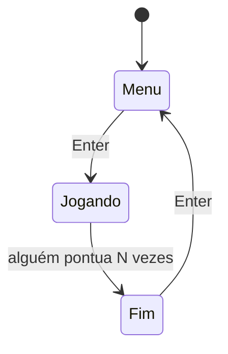

# Aula 16 — Desenvolvimento de Jogos Digitais com HTML5

!!! info "Objetivos da aula"
    - Integrar tudo: **loop, física, entrada, colisão e placar**.
    - Estruturar **estados** do jogo (menu, jogando, fim).
    - Conhecer **engines HTML5** para ir além.

## Juntando as peças

Um jogo é a soma do que vimos: o **game loop** (Aula 15) usa a **matemática** (Aula 14) para atualizar objetos, detecta **colisões**, lê a **entrada** e desenha no **Canvas**. Vamos montar um mini **Pong**.



## Estados do jogo

Controlar em que "tela" o jogo está evita que tudo rode ao mesmo tempo:

```js
let estado = "menu"; // "menu" | "jogando" | "fim"

function loop() {
  ctx.clearRect(0, 0, canvas.width, canvas.height);
  if (estado === "menu") desenharMenu();
  else if (estado === "jogando") atualizarJogo();
  else desenharFim();
  requestAnimationFrame(loop);
}
```

## Mini Pong

=== "Objetos e entrada"
    ```js
    const jogador = { x: 10, y: 130, w: 10, h: 60, v: 5 };
    const bola = { x: 240, y: 160, vx: 4, vy: 3, r: 8 };
    let placar = 0;
    const teclas = {};
    addEventListener("keydown", (e) => (teclas[e.key] = true));
    addEventListener("keyup", (e) => (teclas[e.key] = false));
    ```

=== "Atualização e colisão"
    ```js
    function atualizarJogo() {
      // mover raquete
      if (teclas["ArrowUp"]) jogador.y -= jogador.v;
      if (teclas["ArrowDown"]) jogador.y += jogador.v;

      // mover bola
      bola.x += bola.vx;
      bola.y += bola.vy;

      // quicar no topo/fundo
      if (bola.y < 0 || bola.y > canvas.height) bola.vy *= -1;

      // colisão com a raquete (AABB simplificado)
      if (
        bola.x - bola.r < jogador.x + jogador.w &&
        bola.y > jogador.y &&
        bola.y < jogador.y + jogador.h
      ) {
        bola.vx *= -1;
        placar++;
      }

      // saiu pela esquerda → fim
      if (bola.x < 0) estado = "fim";

      // parede direita
      if (bola.x > canvas.width) bola.vx *= -1;

      desenharJogo();
    }
    ```

=== "Renderização"
    ```js
    function desenharJogo() {
      ctx.fillStyle = "#7c4dff";
      ctx.fillRect(jogador.x, jogador.y, jogador.w, jogador.h);
      ctx.beginPath();
      ctx.arc(bola.x, bola.y, bola.r, 0, Math.PI * 2);
      ctx.fill();
      ctx.font = "20px Inter";
      ctx.fillText("Placar: " + placar, 200, 30);
    }
    ```

!!! tip "Detecção de colisão AABB"
    Para caixas retangulares, use **AABB** (Axis-Aligned Bounding Box): há colisão quando os retângulos se sobrepõem nos dois eixos. Para objetos redondos, use distância entre centros (Aula 14).

## Além do Canvas puro: engines HTML5

Para jogos maiores, engines cuidam de loop, física, sprites e áudio para você:

| Engine | Foco |
| :----- | :--- |
| **Phaser** | Jogos 2D em JS, muito popular |
| **PixiJS** | Renderização 2D rápida (WebGL) |
| **Three.js** | Gráficos **3D** no navegador |

!!! info "Quando usar uma engine?"
    Canvas puro é ótimo para **aprender os fundamentos**. Ao crescer (muitos sprites, física, cenas), uma engine poupa meses de trabalho. Mas os conceitos que você aprendeu aqui continuam valendo por baixo.

## Organizando o código do jogo

Conforme o jogo cresce, separe responsabilidades. Um padrão simples e eficaz:

```js
const jogo = {
  entidades: [],                 // tudo que existe na tela
  update(dt) { /* lógica/física */ },
  render(ctx) { /* desenho */ },
};
```

!!! tip "Update x Render"
    Mantenha **atualizar** (mudar posições, checar colisões) separado de **desenhar** (só pinta o estado atual). Isso facilita achar bugs: se algo está errado na lógica, você olha o `update`; se está feio, olha o `render`.

## Respondendo a uma colisão

Detectar a colisão (Aula 14) é metade; a outra é **reagir**. No Pong, a bola inverte o sentido; em um coletável, o item some e o placar sobe:

```js
if (colidem(bola, raquete)) {
  bola.vx *= -1;            // rebate
  bola.vx *= 1.05;          // acelera um pouco (dificuldade)
  tocar(somRebote);
}
```

## Placar e recorde com `localStorage`

O `localStorage` guarda dados no navegador **entre sessões** — perfeito para o recorde (Exercício 3):

```js
let recorde = Number(localStorage.getItem("recorde")) || 0;

function fimDeJogo() {
  if (placar > recorde) {
    recorde = placar;
    localStorage.setItem("recorde", recorde); // persiste
  }
}
```

## Som no jogo

```js
const somPonto = new Audio("assets/ponto.wav");
function tocar(audio) {
  audio.currentTime = 0; // rebobina, permitindo tocar em sequência rápida
  audio.play();
}
```

!!! warning "Áudio só após interação"
    Navegadores bloqueiam som antes de o usuário interagir com a página. Comece o jogo (e os sons) a partir de um clique ou tecla — o que casa bem com a tela de menu ("Pressione Enter").

## Dificuldade progressiva

Deixe o jogo mais difícil com o tempo para manter o desafio (Exercício 3):

```js
jogo.tempo += dt;
velocidadeInimigo = 100 + jogo.tempo * 5; // acelera aos poucos
```

## Exercícios

??? abstract "Exercício 1 — Complete o Pong"
    Monte o Pong desta aula em um projeto funcional, com tela de menu ("Pressione Enter"), jogo e tela de fim que mostra o placar e permite reiniciar.

??? abstract "Exercício 2 — Seu jogo autoral"
    Crie um jogo simples original (ex.: coletar itens que caem, desviar de obstáculos, "flappy" minimalista) usando loop, entrada, colisão e placar.

??? abstract "Exercício 3 — Polimento"
    Adicione ao seu jogo pelo menos dois destes: som ao pontuar, aumento de dificuldade ao longo do tempo, contador de recordes (`localStorage`) ou uma tela de instruções.

!!! tip "Parabéns, você chegou ao fim! 🎉"
    Você percorreu da primeira tag HTML até um jogo completo. Consolide tudo no **projeto integrador** (a ser definido pelo professor) e resolva a última 👉 [**Lista 16**](../listas/16-lista.md).

## 📚 Referências

- [MDN — Desenvolvimento de jogos](https://developer.mozilla.org/pt-BR/docs/Games)
- [MDN — Faça um jogo estilo Breakout com Canvas puro](https://developer.mozilla.org/pt-BR/docs/Games/Tutorials/2D_Breakout_game_pure_JavaScript)
- [MDN — `Window.localStorage`](https://developer.mozilla.org/pt-BR/docs/Web/API/Window/localStorage)
- [Phaser — engine de jogos 2D em JavaScript](https://phaser.io/)
- [MDN — Usando a API de Áudio Web](https://developer.mozilla.org/pt-BR/docs/Web/API/Web_Audio_API/Using_Web_Audio_API)
